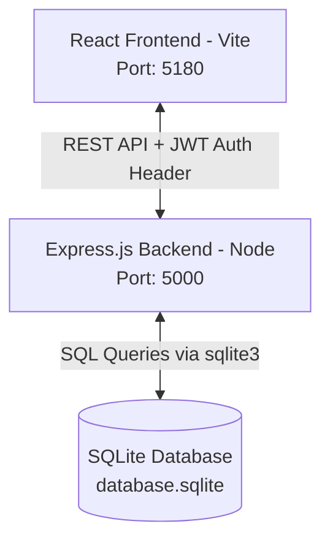
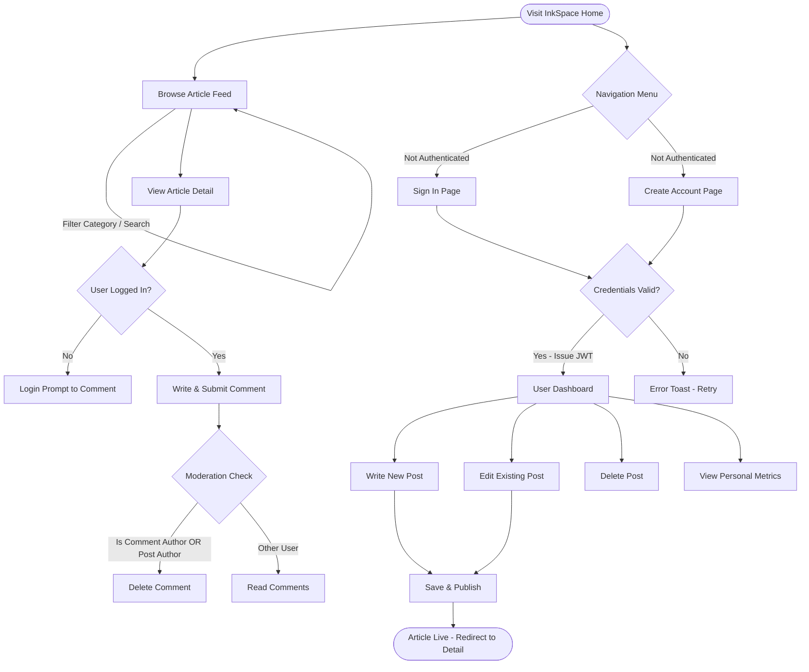

# ✍️ InkSpace — Premium Full-Stack Blogging Platform

InkSpace is an aesthetically striking, high-fidelity, and fully responsive full-stack blogging platform built with **React (Vite)** on the frontend and **Express.js (Node.js) + SQLite** on the backend. 

The application features an elite glassmorphic dark-theme interface, designed with pure, modular **Vanilla CSS** (free from bulky Tailwind or utility libraries). It is packed with premium visual enhancements, including a custom Canvas-based interactive particle background, a global custom toast notification engine, JWT-secured route authentication, a tabbed Markdown text editor, and an advanced, moderated comments discussion engine.

---

## 🗺️ System Flowcharts & Architecture

InkSpace uses a decoupled, three-tier architecture orchestrated concurrently from a single launch script.

### 1. Data & Server Flow


### 2. User Journey Flowchart
This flowchart shows the system paths available to users, detailing authenticated vs. anonymous actions.



---

## 🛠️ Technology Stack

InkSpace is built on a highly performant and clean stack using modern JS standards (ES Modules).

### Frontend (Client-Side)
* **Core**: [React 19](https://react.dev/) — Uses the latest hooks and strict concurrency modes.
* **Routing**: [React Router DOM v7](https://reactrouter.com/) — Single-page application route management.
* **Icons**: [Lucide React](https://lucide.dev/) — Lightweight SVG icons.
* **Styling**: **Vanilla CSS Variables & Grid** — Premium HSL-based design system containing subtle blurs, frosted glass cards, glow frames, and smooth animations.
* **Canvas Engine**: **HTML5 Canvas Context 2D** — Powering interactive background drift particles that repel away from your cursor.

### Backend (Server-Side)
* **Runtime**: [Node.js (v24+)](https://nodejs.org/) & [Express.js](https://expressjs.com/) — RESTful routing and server-side logic.
* **Authentication**: [JSON Web Tokens (JWT)](https://jwt.io/) — Secure, stateless authorization handled via cookies and local storage interceptors.
* **Security**: [bcryptjs](https://www.npmjs.com/package/bcryptjs) — High-entropy hashing of user passwords.
* **Orchestration**: `concurrently` — Orchestrates frontend and backend servers together under a unified standard output.

### Database (SQLite)
* **Engine**: [SQLite 3](https://sqlite.org/) — Highly portable database file (`database.sqlite`) stored directly inside the `backend` folder.
* **Setup**: Zero-configuration needed by the evaluator. The database automatically initializes tables and inserts mock data on startup if no existing file is found.

---

## ✨ Premium UI/UX Highlights

1. ** frosted Glassmorphic Cards**: Beautiful panels layered on top of the moving background, complete with thin glowing border-borders (`rgba(255,255,255,0.08)`) and high backdrop blurs.
2. **Global Custom Toast Notifications**: Success, info, and error notifications slide in dynamically with color-coordinated glowing indicator icons.
3. **Interactive Markdown Editor**: Splitted tabs allow authors to draft using standard symbols (`### Headings`, `**bold**`, bullet points `-`) and immediately preview the styled layout dynamically in real-time before publishing.
4. **Category & Query Filter Chips**: Fast feeds where readers can instantly search keywords or narrow down articles by categories (`Tech`, `Design`, `Development`, `Lifestyle`, etc.) using instant search filters.
5. **Author Dashboard & Metric Aggregator**: A full dashboard for writers summarizing cumulative stats: total posts published, reading time summation, and average article length.

---

## 🚀 Quick Start — Run Locally

The repository is equipped with Windows shell scripts wrappers that bypass PowerShell script restrictions. Follow these simple steps:

### 1. Pre-requisites
Ensure you have [Node.js](https://nodejs.org/) installed.

### 2. Clone the Repository
```bash
git clone https://github.com/mohankrishnakola-68/Blog-Platform-with-comments.git
cd Blog-Platform-with-comments
```

### 3. Install Dependencies
Run the unified installer script from the root folder:
```powershell
npm.cmd run install-all
```
*(This automatically runs npm installs in the root, `/backend`, and `/frontend` folders).*

### 4. Start the Application
Boot up both servers concurrently:
```powershell
npm.cmd run dev
```

* **Frontend Client runs at**: ⚡ [http://localhost:5180](http://localhost:5180)
* **Backend API Server runs at**: 🚀 [http://localhost:5000](http://localhost:5000)

---

## 🔑 Seeded Demo Accounts

The database comes pre-seeded with beautiful sample posts on Modern CSS, Depth Design, and Backend API Proxies. You can sign in using any of the following accounts:

| Username | Email | Password | Role / Account Type |
| :--- | :--- | :--- | :--- |
| `john_developer` | `john@example.com` | `password123` | Software Engineer / Writer |
| `creative_sarah` | `sarah@example.com` | `password123` | Graphic Designer / Writer |
| `tech_guru` | `guru@example.com` | `password123` | Platform Administrator / Writer |

---

## 🧪 Automated Testing Ready

Every input field, submit button, search container, and form action across the app contains descriptive, unique HTML `id` values:
* **Login Form Inputs**: `id="emailOrUsername"`, `id="password"`, `id="login-submit"`
* **Registration Form**: `id="reg-username"`, `id="reg-email"`, `id="reg-password"`, `id="reg-confirm"`, `id="register-submit"`
* **Markdown Editor**: `id="post-title"`, `id="post-content"`, `id="post-summary"`, `id="post-category"`, `id="post-cover"`, `id="publish-btn"`
* **Comments Panel**: `id="comment-input"`, `id="comment-submit"`

*This makes the codebase 100% prepared for instant end-to-end (E2E) testing configurations using Selenium, Cypress, or Playwright.*
